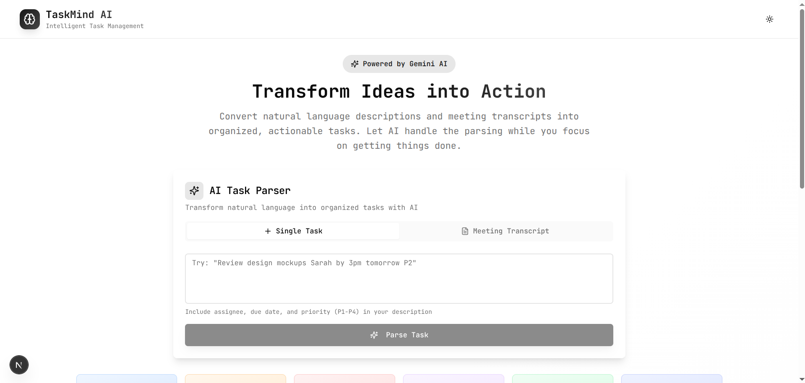
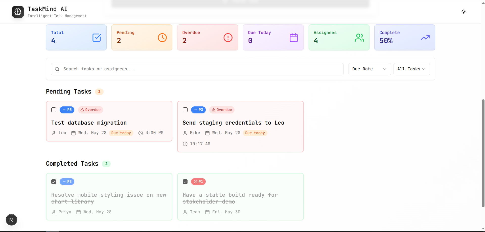

# TaskMind AI - Natural Language Task Manager

TaskMind AI is an intelligent task management application that transforms natural language descriptions and meeting transcripts into organized, actionable tasks. Powered by Gemini AI, it handles the parsing of text while you focus on getting things done.



## Features

- **Natural Language Processing**: Convert free-form text into structured tasks
- **Intelligent Task Parsing**: Automatically extracts task titles, descriptions, priorities, and deadlines
- **Responsive UI**: Beautiful interface that works on both desktop and mobile devices
- **Dark/Light Mode**: Toggle between themes to match your preference
- **Task Organization**: View, edit, filter, and sort your tasks
- **Local Storage**: Your tasks are saved in your browser's local storage

## Task Management

The application organizes your tasks into a clean, intuitive board where you can:

- Filter tasks by status, priority, or search terms
- Edit task details
- Mark tasks as complete
- Delete tasks when no longer needed



## Tech Stack

- **Frontend**: Next.js 15, React 19
- **Styling**: Tailwind CSS, shadcn/ui components
- **State Management**: React Hooks
- **AI Integration**: Gemini AI for natural language processing

## Getting Started

1. Clone the repository
2. Install dependencies:
   ```
   npm install
   # or
   pnpm install
   ```
3. Run the development server:
   ```
   npm run dev
   # or
   pnpm dev
   ```
4. Open your browser and navigate to `http://localhost:3000`

## Usage

1. Enter your tasks in natural language in the input form
2. Let the AI parse your text into structured tasks
3. Manage your tasks on the board
4. Toggle between light and dark modes using the theme toggle

## License

[MIT](LICENSE)

---

Built with ❤️ using Next.js, Tailwind CSS, and Gemini AI
